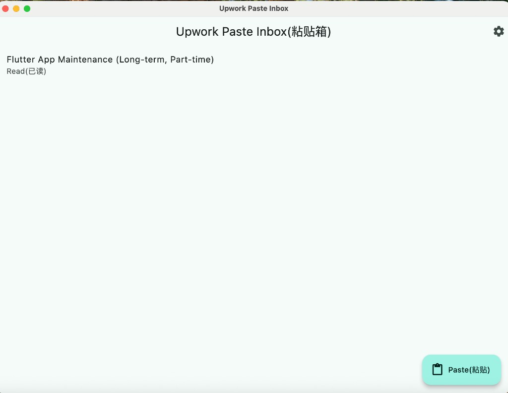
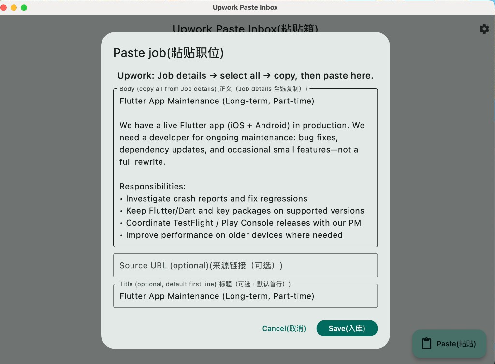
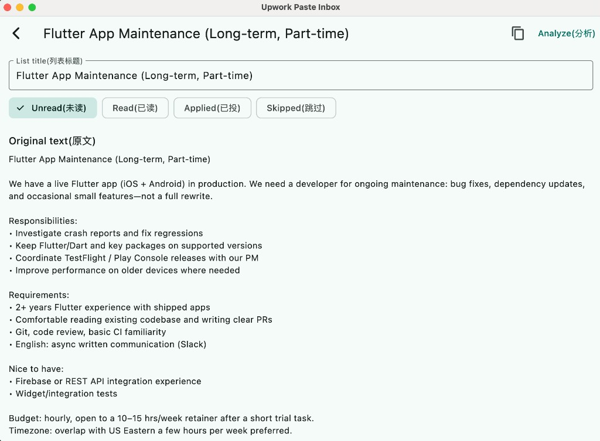
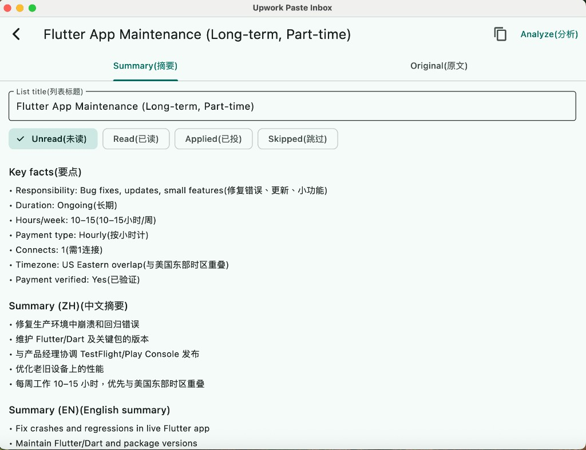
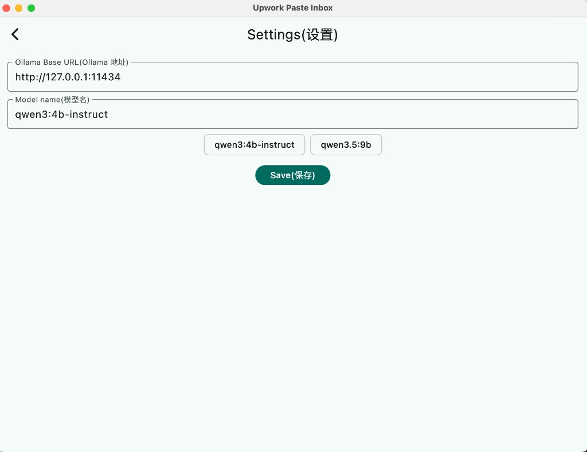

# Upwork Paste Inbox

**macOS · Flutter · local SQLite · Ollama**

Paste Upwork job details from the browser into a private inbox: dedupe, track status, and analyze with a model on your machine. No Upwork login, no scraping.

*Not affiliated with Upwork.*

## What it does

- **Paste** — Copy all from Job details → **Paste** in the app; trims footer noise (e.g. Client’s recent history), keeps About the client & Activity on this job.
- **Track** — Unread / read / applied / skipped (with skip reason); swipe left to delete.
- **Analyze** — Local Ollama: **key facts** (Connects, hours, pay type, duration, competition, client trust), EN + 中文 summaries, **Flutter maintenance** fit (strong / maybe / pass).
- **Share** — Copy full summary + posting to clipboard.

## Screenshots

| Inbox | Paste |
|:---:|:---:|
|  |  |

| Original | Summary (after Analyze) |
|:---:|:---:|
|  |  |

| Settings |
|:---:|
|  |

## Install (no Flutter needed)

Download **`Upwork-Paste-Inbox-macos-unsigned.zip`** from [GitHub Releases](https://github.com/wmsing/upwork-paste-inbox/releases), unzip, drag **Upwork Paste Inbox.app** to **Applications**.

First open: right-click the app → **Open** (unsigned build; no Apple notarization). You still need **Ollama** running locally.

Maintainers: push tag `v0.1.0` (or run **Actions → macOS build → Run workflow**) to publish a new zip.

## Quick start

**Requirements:** macOS, [Ollama](https://ollama.com/) running (`http://127.0.0.1:11434`).

1. Pull a model (examples in app: `qwen3:4b-instruct`, `qwen3.5:9b`):

   ```bash
   ollama pull qwen3:4b-instruct
   ```

2. Run from source:

   ```bash
   flutter pub get
   flutter run -d macos
   ```

3. **Workflow:** Upwork → Job details → `⌘A` `⌘C` → app **Paste** → **Save** → **Analyze** (set model on first run in the dialog or **Settings**).

**Release build** (copy to Applications):

```bash
flutter build macos --release
open build/macos/Build/Products/Release/
```

Drag **Upwork Paste Inbox.app** into `/Applications`.

## Dev

```bash
flutter test && flutter analyze
```

**Stack:** Flutter (macOS), `sqflite_common_ffi`, SharedPreferences, Ollama OpenAI-compatible API (`lib/ollama.dart`). Domain notes: `CONTEXT.md`. Roadmap: Flutter-only v1 → Go jobs REST + LLM proxy for portfolio (ADR in `docs/adr/`).

## License

Personal portfolio tool — add a `LICENSE` before public reuse if needed.
